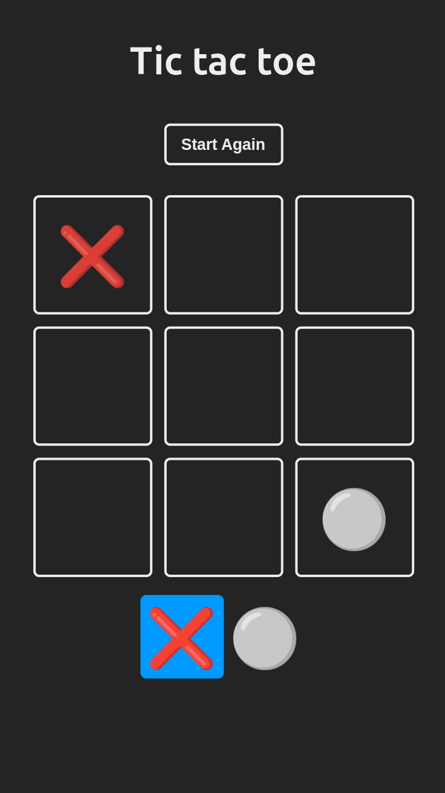

<a id="top"></a>

<h1 align="center"> Tic tac toe</h1>  

<p align="center">
  <a href="#">
    
  </a>
  <a href="https://opensource.org/licenses/MIT" target="_blank">
    
  </a>
</p>

<div align="center">
    <a href="#-acerca-del-proyecto" target="_blank">
        Acerca Del Proyecto
    </a>
    <span>&nbsp;✦&nbsp;</span>
    <a href="#-vista-previa" target="_blank">
        Vista Previa
    </a>
    <span>&nbsp;✦&nbsp;</span>
    <a href="#-características" target="_blank">
        Características
    </a>
    <span>&nbsp;✦&nbsp;</span>
    <a href="#-tecnologías" target="_blank">
        Tecnologías
    </a>
    <span>&nbsp;✦&nbsp;</span>
    <a href="#-cómo-empezar" target="_blank">
        Cómo Empezar
    </a>
    <span>&nbsp;✦&nbsp;</span>
    <a href="#-comandos" target="_blank">
        Comandos
    </a>
    <span>&nbsp;✦&nbsp;</span>
    <a href="#-contribuciones" target="_blank">
        Contribuciones
    </a>
    <span>&nbsp;✦&nbsp;</span>
    <a href="#-licencia" target="_blank">
        Licencia
    </a>
    <span>&nbsp;✦&nbsp;</span>
    <a href="#-Soporte" target="_blank">
        Soporte
    </a>
</div>
<br>

>Si quieres leer este readme en **inglés**:
>- [**README en Inglés**](https://github.com/joserafael0160/tic-tac-toe/blob/main/README.md)

## 📜 Acerca Del Proyecto
¡Bienvenido a mi aplicación web de Tic Tac Toe! He creado este juego clásico para mostrar mis habilidades y capacidades de resolución de problemas.

Si estás jugando contra un amigo, prepárate para planificar estrategias, hacer tus movimientos y reclamar la victoria en esta batalla atemporal. 🎮✨

<p align="right">(<a href="#top" >Volver al inicio 🔝</a>)</p>

## 👀 Vista previa
<h4>En un iPhone SE (375x667)</h4>


<p align="right">(<a href="#top">Volver al inicio 🔝</a>)</p>

## 💬 Características
- **Soporte para favicon**: Se ha añadido soporte para una amplia variedad de tamaños de favicon, asegurando que el icono del sitio se muestre correctamente en todos los dispositivos y plataformas.
- **Etiquetas Open Graph y Twitter**: Se han incluido etiquetas meta de Open Graph y Twitter, que optimizan la vista previa del sitio web en plataformas sociales como Facebook y Twitter.
- **Compatibilidad entre navegadores**: La página web utiliza la etiqueta meta `X-UA-Compatible`, que ayuda a garantizar la compatibilidad con varios navegadores, especialmente las versiones antiguas de Internet Explorer.
- **Algoritmo para ganar**: El algoritmo para determinar si un jugador ha ganado es esencial para la funcionalidad del juego. Al verificar las combinaciones ganadoras (a través de un algoritmo), aseguramos que el juego declare correctamente al ganador.
- **Algoritmo para empates**: El algoritmo de empate evita que el juego continúe indefinidamente. Comprueba si todos los cuadrados están llenos y no hay un ganador, declarando un empate.
- **Animación de confeti al ganar**: Agregar confeti al final del juego crea una experiencia visualmente agradable y emocionante. Añade un toque divertido y festivo al juego.

<p align="right">(<a href="#top">Volver al inicio 🔝</a>)</p>


## 🧰 Tecnologías utilizadas
- [**React**](https://reactjs.org/) - Una biblioteca de JavaScript para construir interfaces de usuario interactivas.
- [**Vite**](https://vitejs.dev/) - Un entorno de desarrollo rápido y ligero para aplicaciones web modernas.
- [**ESLint**](https://eslint.org/) - Una herramienta de código abierto que te ayuda a encontrar y corregir problemas en tu código JavaScript.

<p align="right">(<a href="#top">Volver al inicio 🔝</a>)</p>


## 🚀 Cómo Empezar
1. **Haz un Fork** o clona este repositorio

```bash
git clone git@github.com:joserafael0160/tic-tac-toe.git
```

2. Instala las dependencias:

- Usé [**bun**](https://bun.sh) para instalar y gestionar las dependencias.
  
```bash
## Instala bun para MacOS, WSL & Linux:
curl -fsSL https://bun.sh/install | bash

# Instala bun para Windows:
powershell -c "iwr bun.sh/install.ps1|iex"

# Instala con bun:
bun install
```

- o puedes usar [**pnpm**](https://pnpm.io):

```bash
# Instala pnpm globalmente si no lo tienes:
npm install -g pnpm

# Instala las dependencias:
pnpm install
```

3. Ejecuta el servidor de desarrollo:

```bash
# Ejecuta con bun:
bun run dev

# Ejecuta con pnpm:
pnpm run dev
```

<p align="right">(<a href="#top">Volver al inicio 🔝</a>)</p>

## 🧞 Comandos
|      | Comando   | Acción                                         |
| :--- | :-------- | :-------------------------------------------- |
| ⚙️    | `dev`     | Inicia el servidor de desarrollo local.           |
| ⚙️    | `build`   | Genera la versión de producción en `./dist/`.    |
| ⚙️    | `lint`    | Ejecuta ESLint para encontrar problemas en tu código JavaScript. |
| ⚙️    | `preview` | Muestra una vista previa de la versión local.                      |
| ⚙️    | `predeploy` | Genera la versión de producción antes de implementarla. |
| ⚙️    | `deploy`  | Implementa el sitio en GitHub Pages desde la carpeta `dist`. |

<p align="right">(<a href="#top">Volver al inicio 🔝</a>)</p>

## 🤝 Contribuciones

¡Las contribuciones son siempre bienvenidas! Ya sea que estés informando errores, solicitando nuevas funciones o mejorando las funcionalidades existentes, tu ayuda es **muy apreciada**.

Si tienes alguna sugerencia que podría mejorar el proyecto, por favor haz un [_fork_](https://github.com/joserafael0160/tic-tac-toe/fork) del repositorio y crea una [_pull request_](https://github.com/joserafael0160/tic-tac-toe/pulls). También puedes simplemente abrir un [_issue_](https://github.com/joserafael0160/tic-tac-toe/issues) con la etiqueta "enhancement".

Aquí tienes una guía rápida:

1. Haz un [_fork_](https://github.com/joserafael0160/tic-tac-toe/fork) del Proyecto
2. Clona tu [_fork_](https://github.com/joserafael0160/tic-tac-toe/fork) (`git clone <URL del fork>`)
3. Añade el repositorio original como remoto (`git remote add upstream <URL del repositorio original>`)
4. Crea tu Rama de Funcionalidad (`git switch -c feature/NuevaFuncionalidad`)
5. Realiza tus Cambios (`git commit -m 'Add: alguna NuevaFuncionalidad'`)
6. Haz Push a la Rama (`git push origin feature/NuevaFuncionalidad`)
7. Abre una [_pull request_](https://github.com/joserafael0160/tic-tac-toe/pulls)

<p align="right">(<a href="#top">Volver al inicio 🔝</a>)</p>

## 🔑 Licencia
[MIT](https://github.com/joserafael0160/tic-tac-toe/blob/main/LICENSE)

<p align="right">(<a href="#top">Volver al inicio 🔝</a>)</p>

## 🙏 Soporte
No olvides dejar una estrella ⭐️

<p align="right">(<a href="#top">Volver al inicio 🔝</a>)</p>

<br>
<hr>
<p align="center">✌️</p>
<p align="center">
<sub><sup>Un proyecto creado por <a href="https://github.com/joserafael0160">@joserafael0160</a></sup></sub>