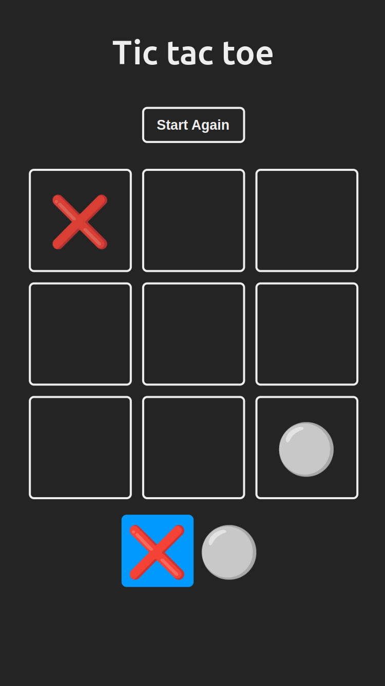

<a id="top"></a>

<h1 align="center"> Tic tac toe</h1>


<p align="center">
  <a href="#">
    
  </a>
  <a href="https://opensource.org/licenses/MIT" target="_blank">
    
  </a>
</p>

<div align="center">
    <a href="#-about" target="_blank">
        About
    </a>
    <span>&nbsp;✦&nbsp;</span>
    <a href="#-preview" target="_blank">
        Preview
    </a>
    <span>&nbsp;✦&nbsp;</span>
    <a href="#-features" target="_blank">
        Features
    </a>
    <span>&nbsp;✦&nbsp;</span>
    <a href="#-stack" target="_blank">
        Stack
    </a>
    <span>&nbsp;✦&nbsp;</span>
    <a href="#-getting-starter" target="_blank">
        Getting Started
    </a>
    <span>&nbsp;✦&nbsp;</span>
    <a href="#-commands" target="_blank">
        Commands
    </a>
    <span>&nbsp;✦&nbsp;</span>
    <a href="#-contributions" target="_blank">
        Contributions
    </a>
    <span>&nbsp;✦&nbsp;</span>
    <a href="#-license" target="_blank">
        License
    </a>
    <span>&nbsp;✦&nbsp;</span>
    <a href="#-support" target="_blank">
        Support
    </a>
</div>
<br>

>If you want to read this readme in **Spanish**
>- [**Spanish README**](https://github.com/joserafael0160/tic-tac-toe/blob/main/README.es.md)

## 📜 About 
Welcome to my Tic Tac Toe web app! I’ve created this classic game to showcase my skills and problem-solving abilities. 

If you’re playing against a friend, get ready to strategize, make your moves, and claim victory in this timeless battle! 🎮✨

<p align="right">(<a href="#top" >Go Back To Top 🔝</a>)</p>

## 👀 Preview
<h4>In a iPhone SE (375x667)</h4>


<p align="right">(<a href="#top">Go Back To Top 🔝</a>)</p>


## 💬 Features
- **Favicon Support**: Support for a wide range of favicon sizes has been added, ensuring that the site’s icon displays correctly on all devices and platforms.
- **Open Graph and Twitter Tags**: Open Graph and Twitter meta tags have been included, which optimize the preview of the website on social platforms like Facebook and Twitter.
- **Cross-Browser Compatibility**: The web page uses the `X-UA-Compatible` meta tag, which helps ensure compatibility with multiple browsers, especially older versions of Internet Explorer.
- **Algorithm for Winning**: The algorithm to determine if a player has won is essential for the game’s functionality. By checking winning combinations (through an algorithm), we ensure that the game correctly declares the winner.
- **Alogrithm for Ties**: The tie algorithm prevents the game from continuing indefinitely. It checks if all squares are filled and there is no winner, declaring a tie.
- **Confetti Animation on Win**:  Adding confetti at the end of the game creates a visually pleasing and exciting experience. It adds a fun and festive touch to the game.
  
<p align="right">(<a href="#top">Go Back To Top 🔝</a>)</p>

## 🧰 Stack
- [**React**](https://reactjs.org/) - A JavaScript library for building interactive user interfaces.
- [**Vite**](https://vitejs.dev/) - A fast and lightweight development environment for modern web applications.
- [**ESLint**](https://eslint.org/) - An open-source tool that helps you find and fix problems in your JavaScript code.


<p align="right">(<a href="#top">Go Back To Top 🔝</a>)</p>


## 🚀 Getting Starter
1. **Fork** or clone this repository

```bash
git clone git@github.com:joserafael0160/tic-tac-toe.git
```

2. Install the dependencies: 

- I used [**bun**](https://bun.sh) to install and manage the dependencies.
  
```bash
# Install bun for MacOS, WSL & Linux:
curl -fsSL https://bun.sh/install | bash

# Install bun for Windows:
powershell -c "iwr bun.sh/install.ps1|iex"

# Install with bun:
bun install
```

- or you can use [**pnpm**](https://pnpm.io):

```bash
# Install pnpm globally if you don't have it:
npm install -g pnpm

# Install dependencies:
pnpm install
```

1. Run the development server:

```bash
# Run with bun:
bun run dev

# Run with pnpm:
pnpm run dev
```

<p align="right">(<a href="#top">Go Back To Top 🔝</a>)</p>

## 🧞 Commands
|      | Command   | Action                                         |
| :--- | :-------- | :-------------------------------------------- |
| ⚙️    | `dev`     | Starts the local development server.           |
| ⚙️    | `build`   | Builds the production version to `./dist/`.    |
| ⚙️    | `lint`    | Runs ESLint to find issues in your JavaScript code. |
| ⚙️    | `preview` | Previews the local build.                      |
| ⚙️    | `predeploy` | Generates the production version before deploying. |
| ⚙️    | `deploy`  | Deploys the site to GitHub Pages from the `dist` folder. |


<p align="right">(<a href="#top">Go Back To Top 🔝</a>)</p>


## 🤝 Contributions

Contributions are always welcome! Whether you’re reporting bugs, requesting new features, or improving existing functionalities, your help is **greatly appreciated**.

If you have any suggestions that could improve the project, please make a [_fork_](https://github.com/joserafael0160/tic-tac-toe/fork) of the repository and create a [_pull request_](https://github.com/joserafael0160/tic-tac-toe/pulls). You can also simply open an [_issue_](https://github.com/joserafael0160/tic-tac-toe/issues) with the “enhancement” label.

Here is a quick guide:

1. Make a [_fork_](https://github.com/joserafael0160/tic-tac-toe/fork) of the Project
2. Clone your [_fork_](https://github.com/joserafael0160/tic-tac-toe/fork) (`git clone <URL of the fork>`)
3. Add the original repository as remote (`git remote add upstream <URL of the original repository>`)
4. Create your Feature Branch (`git switch -c feature/NewFeature`)
5. Make your Changes (`git commit -m 'Add: some NewFeature'`)
6. Push to the Branch (`git push origin feature/NewFeature`)
7. Open a [_pull request_](https://github.com/joserafael0160/tic-tac-toe/pulls)

<p align="right">(<a href="#top">Go Back To Top 🔝</a>)</p>

## 🔑 License
[MIT](https://github.com/joserafael0160/tic-tac-toe/blob/main/LICENSE)

<p align="right">(<a href="#top">Go Back To Top 🔝</a>)</p>

## 🙏 Support
Don't forget to leave a star ⭐️

<p align="right">(<a href="#top">Go Back To Top 🔝</a>)</p>

<br>
<hr>
<p align="center">✌️</p>
<p align="center">
<sub><sup>A project created by <a href="https://github.com/joserafael0160">@joserafael0160</a></sup></sub>